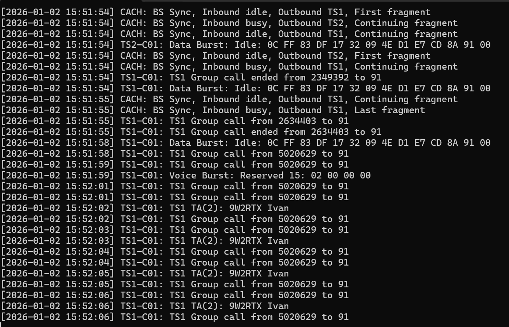
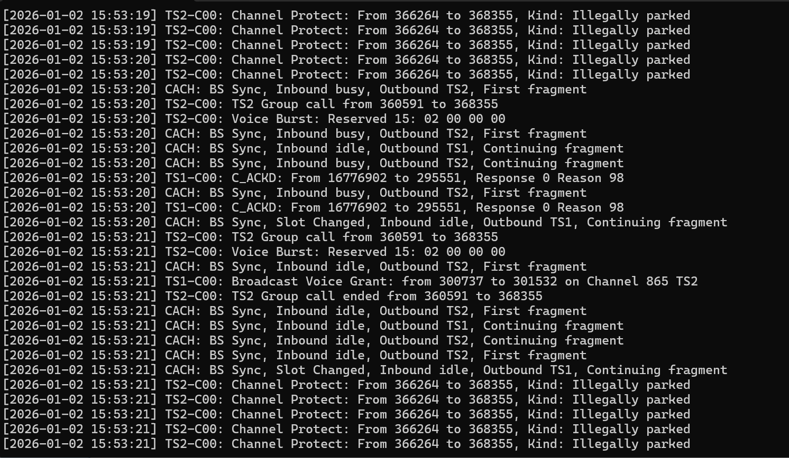

# Support

* If you like my work, you can support me through https://ko-fi.com/DualTachyon

# Warning

If you're the type of person that asks for ready made Code Plugs on Facebook/Telegram/etc, this repository is not for you and you shouldn't waste your time here.

# Welcome to AnyTi3r!

AnyTi3r is a side project I developed while reverse engineering the AnyTone D168UV firmware. The main goal was to dump the command and reply exchanges between the MCU and the DMR chip for analysis. I then found out that the DMR chip will happily send back the majority (if not all, but I didn't check) of the CSBK and other data frames to the MCU. This means that it is possible to extract and display Tier 3 packets, hence the name of this repository. It will also work with Tier 2 and below, but the output is less interesting or verbose.

It consists of 2 components:
- A modified 1.07 firmware.
- A Windows executable.

The Python script in this repository will help you modify the official firmware onto a new set of files. The new files can be used with the AnyTone CPS firmware updater feature. Radtel and other vendors should take note, AnyTone allow users to flash their own firmware.

The Windows executable will monitor these byte streams and decode some of the interesting frames.

Sample screenshots<br>


<br>

# Patch

The patch modifies the firmware so that traffic between the MCU and the DMR chip are mirrored over the USB-C serial port.
The script expects the 1.07 FW to be in the same folder of invocation and will generate a set of firmware files named "AnyTi3r-107.xxx".

Invocation:
```
python3 AnyTi3r-Patch.py 
```

Point the AnyTone D168UV CPS software to the same folder, and select the relevant file. Then go ahead and flash it.

# Decoding DMR frames

Run the .exe and figure it out. This is not a toy.

# Warranty / Support

The patch introduces new behaviour the firmware may not be expecting. As a result, the performance profile may be affected and bugs may appear. Don't expect miracles as this is just an experiment for my own research. Sometimes the 168 will not open any RX, even though it appears in the logs. I don't know why, nor am I going to figure out why.

The radio should be largely usable, but if it doesn't for you, go ahead and flash back the official firmware.

Currently, voice frames are not dumped unless they are encrypted. There is a way to enable the firmware to dump them, but I'm currently not interested in that.

I got all the information I needed, so don't expect this to be updated much. Source code is available so you can improve it if need be.

